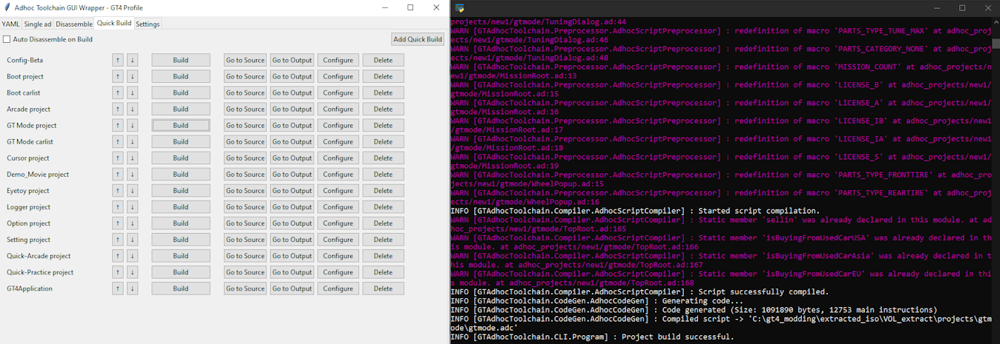

# GTAdhocToolchain
A toolchain for the Gran Turismo scripting language, Adhoc, from C#. 

Adhoc is a scripting language that is used for roughly 99% of the entire games's logic, the native code serving mostly solely as the engine.

The toolchain contains the following:
* **Adhoc Script Preprocessor / Parser / Compiler / CodeGen** (`.ad` -> `.adc`) 
  * Supports adhoc bytecode version 7 (GT4), 10 (GT4O/TT), 12 (GTPSP/GT5/GT6/GT Sport) with experimental support for Version 5 (GT4)
* **Adhoc Project Builder**
  * Compiles menu sources from a `.yaml` project file to `.adc`, `.mproject`, `.mpackage`
* VS Code Extension
* Menu Layout Reader/Serializer (`.mproject/.mwidget`)
* Script and Menu Layout Packager (GT6 `.mpackage`)
* Asset Packager (`.gpb`)
* Script Disassembler (`.adc` to assembly-like syntax)
* Compare scripts for dissasembly matching

## Python GUI Wrapper
Inside the scripts folder, AdhocToolchainGUI.py provides a graphical interface for Adhoc Toolchain with the ability to compile and disassemble scripts. No .gpb, .mproject, or .mpackage implementation currently.
The GUI script gives users the ability to automate the script compilation workflow easily by saving the user's configuration of input scripts and their output locations.

 

## Wiki
Refer to the [Wiki](https://github.com/Nenkai/GTAdhocToolchain/wiki) for more information (compiler, language features, etc).

## Current State
The toolchain is capable of compiling fully working original and custom projects (see [OpenAdhoc](https://github.com/Nenkai/OpenAdhoc)).

## TODOs
* Improve syntatic analysis during compilation.
* Further document the language and instructions themselves.
* Examples
* Possibly tests
* API Documentation

### Compiler accuracy
* Implement [short-circuit evaluation](https://en.wikipedia.org/wiki/Short-circuit_evaluation) optimization such that `LOGICAL_OR` and `LOGICAL_AND` jump to the end of a statement rather than jump to the next `LOGICAL_*` instruction

## Compiler
A fork of [esprima-dotnet](https://github.com/Nenkai/esprima-dotnet) is used to lex and parse the Adhoc code into an abstract syntax tree prior to compiling.
